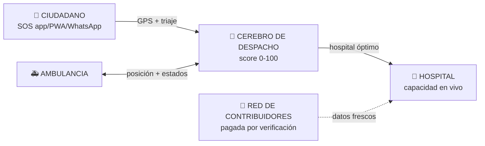
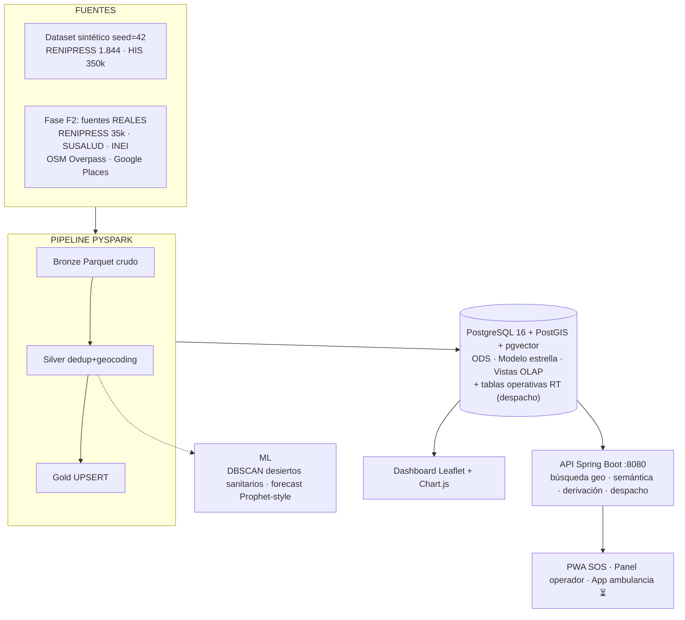

# 🚑 SALUD CERCA

> **Lakehouse geo-analítico sanitario del Perú evolucionando a plataforma SaaS de despacho de emergencias y ambulancias por suscripción.**


---

## 🎯 El producto

**"Uber de ambulancias + cerebro anti-saturación"**: conectamos al ciudadano en emergencia
con la ambulancia disponible más cercana y el hospital óptimo (no saturado, nivel adecuado,
cercano), alimentado por tres canales de datos — oficiales, minado web/API y una red humana
pagada de verificadores.



**Flujos de trabajo completos** (ciudadano, operador B2B, contribuidor, economía):
▶ **[docs/PRODUCTO.md](docs/PRODUCTO.md)**

## 🏗️ Arquitectura de un vistazo



| Componente | Tecnología | Estado |
|---|---|---|
| Generador de datos | Python (seed=42) + embeddings 384d | ✅ |
| Pipeline Medallón | PySpark 3.5.5, idempotente + `MANIFEST.json` | ✅ |
| Base de datos | PostgreSQL 16 + PostGIS 3.4 + pgvector (Docker) | ✅ |
| Modelo estrella | Kimball: `fact_atenciones_medicas` + dims | ✅ |
| Motor de derivación | `recomendar_derivacion()` anti-saturación 50/30/20 | ✅ |
| Módulo ML | DBSCAN IPRESS + forecast mensual | ✅ |
| QA | 10 validaciones Gold + 7 derivación + idempotencia e2e | ✅ |
| Dashboard | HTML autónomo (Leaflet + Chart.js) | ✅ |
| API backend | Spring Boot 3.5 REST + pgvector + PostGIS | ✅ |
| **Capa operativa RT** | Tablas despacho + contribuidores (`08`/`09`) | 🔨 F0 |
| Frontend ciudadano | React Native + PWA + WhatsApp | ⏳ F5 |

## 🚀 Quick start

```bash
# 1. Dataset sintético
python data/generate_seed.py --rows 350000

# 2. PostgreSQL + PostGIS + pgvector (esquema + seed automático)
docker compose up -d --build db

# 3. Pipeline Medallón
python data-pipeline/main.py            # o --stage bronze|silver|gold

# 4. Control de calidad
python qa/run_qa.py && python qa/run_qa_derivaciones.py

# 5. Dashboard
python dashboard/generar_dashboard.py && start dashboard/index.html

# 6. ML
pip install -r ml/requirements-ml.txt && python ml/main.py

# 7. Backend API
cd backend && mvnw.cmd package && java -jar target/backend-1.0.0.jar
#   GET /api/ipress/cercanas?lat=-12.05&lon=-77.04&radioKm=50
#   GET /api/buscar/ipress?texto=cardiologia      (semántica pgvector)
#   GET /api/derivacion/recomendar?origen=...&especialidad=...
#   GET /api/despacho/ambulancias/cercanas?lat=..&lon=..   (nuevo F0)
```

> ⚠️ Los scripts de `db/init/NN_*.sql` corren solo en el **primer arranque** del volumen.
> En un volumen existente aplicar manualmente:
> `docker compose exec -T db psql -U saludcerca -d saludcerca < db/init/08_despacho.sql`

## 📊 Batch demo 2024

**1.844** IPRESS · **349.887** atenciones HIS · **957** distritos · **51** clusters DBSCAN
(**90** IPRESS aisladas = candidatas a desierto sanitario) · forecast 2025 ≈ 29.300–29.900 atenciones/mes.

## 📚 Documentación

| Documento | Contenido |
|---|---|
| [docs/PRODUCTO.md](docs/PRODUCTO.md) | Producto: módulos M1–M6, flujos de trabajo, suscripciones, roadmap F0→F5 |
| [docs/SISTEMA.md](docs/SISTEMA.md) | Técnica canónica: arquitectura Medallón, ER, índices, vistas, QA, backend |
| [docs/vault/_MOC.md](docs/vault/_MOC.md) | Vault Obsidian: conocimiento vivo del proyecto (abrir carpeta con Obsidian) |
| graphify-out/GRAPH_REPORT.md | Grafo de conocimiento del código (generado con Graphify) |

## 🗂️ Estructura

```text
SaludCerca/
├── .github/workflows/ci.yml # CI end-to-end (pipeline + QA + tests + backend)
├── backend/                 # API REST Spring Boot (Gold/PostGIS/pgvector)
├── data/                    # Generador dataset sintético + embeddings
├── data-pipeline/           # PySpark bronze/silver/gold + MANIFEST + tests
├── db/init/                 # SQL: extensiones → ODS → estrella → índices → vistas → seed → derivación → despacho(08) → enriquecimiento(09)
├── dashboard/               # Dashboard HTML generado
├── qa/                      # Validaciones + idempotencia
├── ml/                      # DBSCAN geoespacial + forecast + tests
├── docs/                    # SISTEMA.md (técnica) · PRODUCTO.md (negocio) · vault/ (Obsidian)
└── graphify-out/            # Grafo de conocimiento del código
```
