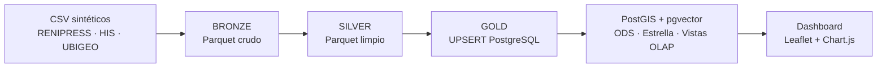

# SALUD CERCA

Lakehouse geo-analítico de **cobertura sanitaria** del Perú, construido sobre datos
sintéticos RENIPRESS y HIS-MINSA. Integra un **pipeline Medallón (Bronze → Silver →
Gold)** en PySpark con **PostgreSQL 16 + PostGIS 3.4 + pgvector**, un **modelo
dimensional en estrella** para BI y un **dashboard geo-analítico**.

## Arquitectura de un vistazo



| Componente | Tecnología | Estado |
|---|---|---|
| Generador de datos | Python (seed=42) + embeddings 384d | ✅ |
| Pipeline Medallón | PySpark 3.5.5 | ✅ |
| Base de datos | PostgreSQL 16 + PostGIS 3.4 + pgvector (Docker) | ✅ |
| Modelo estrella | Kimball: `fact_atenciones_medicas` + 3 dims | ✅ |
| QA y tests | `qa/check_gold.sql` (10 validaciones) + pytest | ✅ |
| Dashboard | HTML autónomo (Leaflet + Chart.js) | ✅ |
| Motor de derivación | `recomendar_derivacion()` anti-saturación | ✅ |
| Módulo ML | DBSCAN IPRESS + forecast mensual (estilo Prophet) | ✅ |
| CI end-to-end | GitHub Actions (`pipeline + QA + tests`) | ✅ |
| Versionado del lakehouse | `MANIFEST.json` por etapa (conteos + commit) | ✅ |
| API backend / frontend | Spring Boot · React | ⏳ pendiente |

## Quick start

```bash
# 1. Generar dataset sintético (data/output/*.csv)
python data/generate_seed.py --rows 350000

# 2. Levantar PostgreSQL + PostGIS + pgvector (esquema + seed automático)
docker compose up -d --build db

# 3. Ejecutar el pipeline Medallón (todas las etapas)
python data-pipeline/main.py

# 4. Control de calidad de la capa Gold
python qa/run_qa.py

# 5. Generar y abrir el dashboard
python dashboard/generar_dashboard.py
start dashboard/index.html

# 6. Módulo ML (DBSCAN + forecast sobre la capa Silver)
pip install -r ml/requirements-ml.txt
python ml/main.py
python -m pytest ml/tests

# 7. CI (reproduce la validación completa en GitHub Actions)
#   Ver .github/workflows/ci.yml — requiere repo remoto con Actions habilitado.
```

## Documentación completa

▶ **[docs/SISTEMA.md](docs/SISTEMA.md)** — Documentación técnica del sistema con
diagramas Mermaid (arquitectura Medallón, secuencia del pipeline, modelos ER
transaccional y estrella, índices, vistas OLAP, despliegue, QA y roadmap).

## Datos del batch de demostración (2024)

- **1.844** establecimientos de salud (IPRESS) · **957** distritos · **25** departamentos
- **349.887** atenciones HIS (350.000 crudas − 113 duplicadas)
- **9** categorías I-1..III-E · **16** especialidades · **12** particiones mensuales
- `dim_tiempo`: **366** días (año bisiesto)

## Estructura

```text
SaludCerca/
├── .github/workflows/ci.yml # CI end-to-end (pipeline + QA + tests)
├── data/                # Generador de dataset sintético + embeddings
├── data-pipeline/       # Pipeline PySpark (bronze / silver / gold) + MANIFEST + tests
├── db/init/             # SQL: extensiones, esquema ODS, estrella, índices, vistas, seed, derivación
├── dashboard/           # Generador del dashboard HTML
├── qa/                  # Suite de validaciones + idempotencia
├── ml/                  # DBSCAN geoespacial + forecast mensual (sobre Silver) + tests
└── docs/SISTEMA.md      # Documentación técnica con diagramas Mermaid
```
