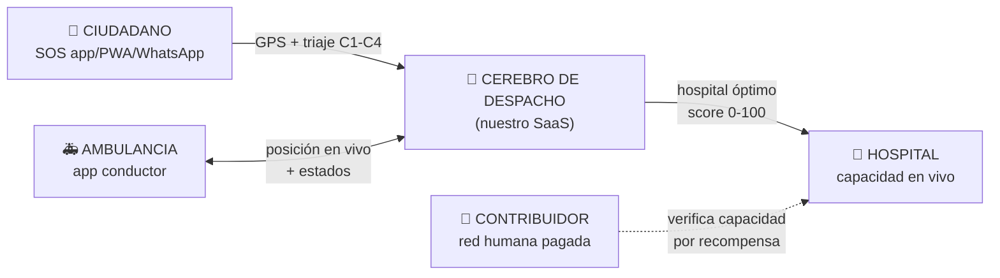
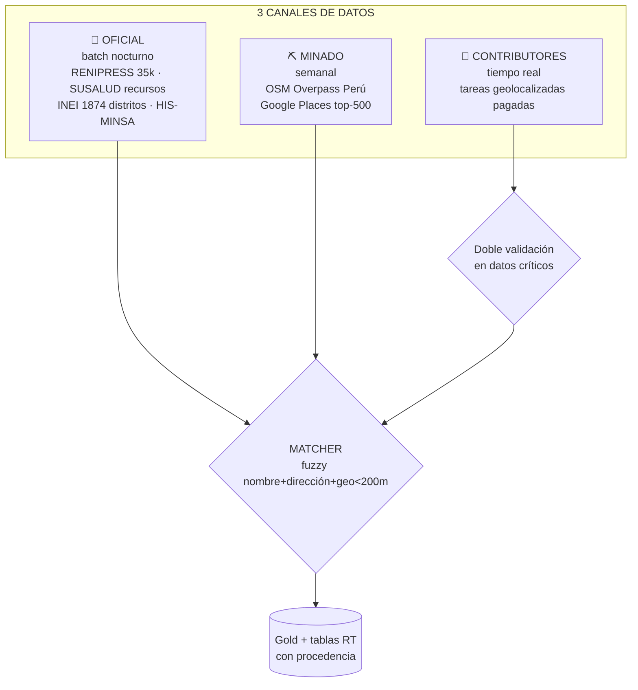
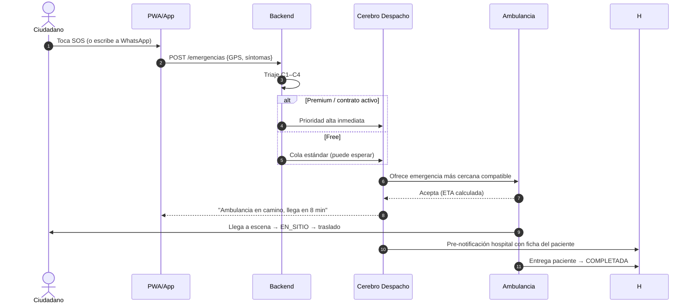
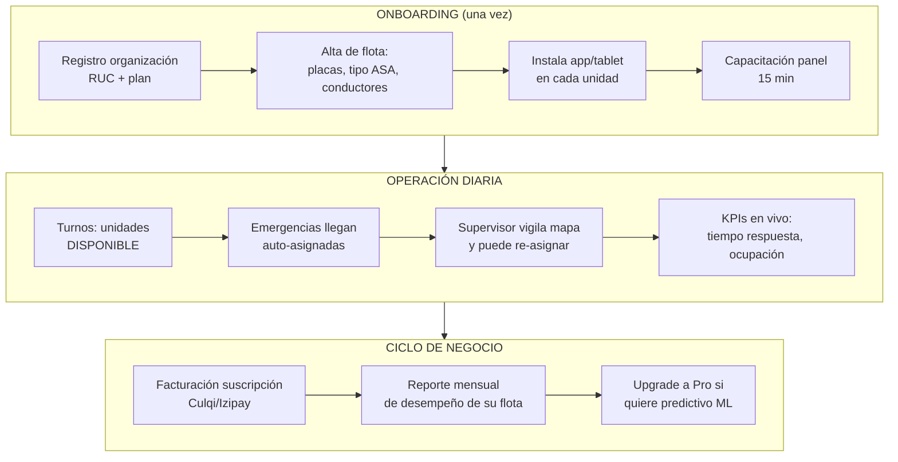
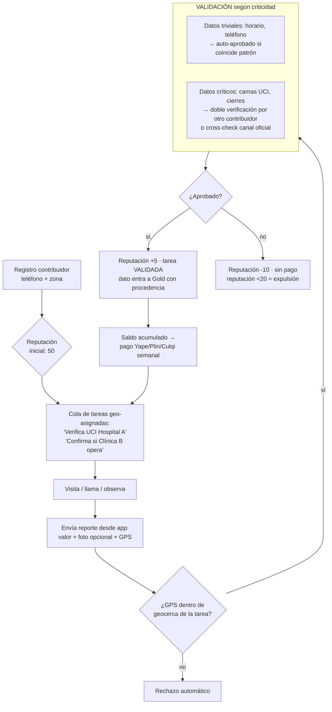
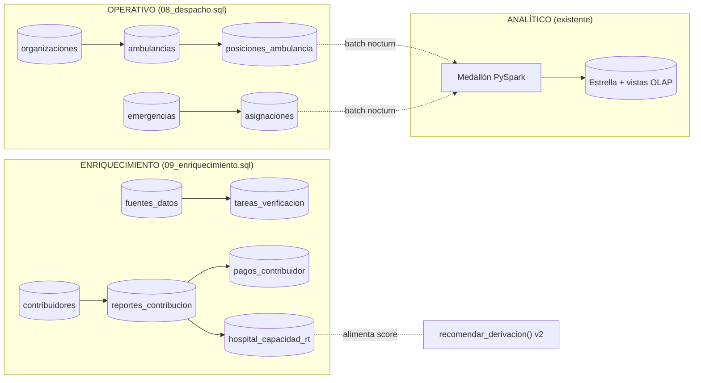

# SALUD CERCA — Plan de Producto

> De lakehouse geo-analítico a **plataforma SaaS de emergencias médicas** para el Perú.
> Documento técnico del sistema actual: [`SISTEMA.md`](SISTEMA.md) · Conocimiento vivo: `docs/vault/`

---

## 1. Problema

| Dolor | Evidencia |
|---|---|
| Despacho de ambulancias a ciegas | No hay visibilidad de disponibilidad ni ubicación de unidades |
| Hospitales equivocados/saturados | ~40% de derivaciones sin destino asignado, ~6% a IPRESS inactivas (hallazgo del propio dataset) |
| Datos oficiales desactualizados | RENIPRESS/SUSALUD se publican una vez al mes; la capacidad real cambia cada hora |

## 2. Solución: los 3 actores

## 3. Módulos funcionales (M1–M6)

### M1 · Canal de emergencia ciudadano
Botón SOS en PWA/app que envía GPS + tipo de emergencia; chatbot WhatsApp Business (canal dominante en Perú); IVR telefónico como respaldo. Triaje simplificado estilo Manchester (C1 crítico → C4 leve) en ≤5 preguntas.

### M2 · Despacho inteligente (el corazón)
Selección de unidad = disponible más cercana por distancia real PostGIS (`ambulancia_disponible_cercana()`), luego evoluciona a ruta real (OSRM) y ETA. Selección de hospital = **`recomendar_derivacion()` v2**: el score 50% anti-saturación / 30% cercanía / 20% nivel+historial ya construido, ahora alimentado también por `hospital_capacidad_rt` (camas UCI reportadas en vivo).

### M3 · App/tablet ambulancia
Navegación a escena y al hospital; botones de estado (`EN_CAMINO → EN_SITIO → TRANSPORTE → ENTREGADO`) que sellan los timestamps SLA; registro offline-first.

### M4 · Panel SaaS operador
Mapa WebSocket de flota + cola de emergencias; KPIs (tiempo medio de respuesta, % asignación <60s, ocupación); facturación. El dashboard analítico actual (Leaflet+Chart.js sobre la capa Gold) se integra como pestaña premium.

### M5 · Posicionamiento predictivo
El forecast existente escala de mensual-nacional a **zonal×hora×día** → sugiere dónde estacionar unidades en espera (*dynamic standby*), reduciendo tiempos de respuesta 20–40%.

### M6 · Motor de enriquecimiento + red de contribuidores

Fuentes investigadas (URLs y detalle): `docs/vault/01-Producto/Fuentes-Datos-Investigacion.md`.

---

## 4. Flujos de trabajo

### 4.1 Ciudadano — SOS (free vs premium)

### 4.2 Operador B2B — ciclo completo (cliente que paga)

### 4.3 Contribuidor — red humana pagada (modelo Waze-salud)

**Tarifario orientativo:** reporte puntual S/2–5 · auditoría completa con fotos S/10–20 · bono por racha de precisión.
**Financiamiento:** fondo de datos = 15% del MRR de suscripciones B2B (los clientes sostienen el sistema *y* financian a quienes lo alimentan). Ver `docs/vault/01-Producto/Suscripciones-Economia.md`.

### 4.4 Flujo de datos (persistencia)

---

## 5. Modelo de suscripción

| Plan | A quién | Precio orientativo | Incluye |
|---|---|---|---|
| Ciudadano Free | Público | S/0 | SOS limitado, cola estándar |
| Ciudadano Premium | Familias | S/19–39/mes | Prioridad, perfiles familiares, tracking |
| Operador Basic | Empresas/municipios | ~S/250/unidad/mes | Panel despacho, navegación, KPIs básicos |
| Operador Pro | Flotas medianas/grandes | ~S/400/unidad/mes | + ML predictivo, analytics Gold, API |
| Hospital | Clínicas/redes | S/1.500+/mes | Pre-avisos, gestión capacidad RT, estadísticas |

Unit economics de ejemplo: empresa con 10 unidades Basic ≈ S/2.500/mes → 20 clientes ≈ S/60k MRR.

## 6. Roadmap

| Fase | Duración | Entregable clave |
|---|---|---|
| **F0 Fundamentos RT** ✅ en curso | 2-3 sem | SQL 08/09 + backend despacho/contribución |
| **F1 MVP despacho** | 4-6 sem | PWA SOS + panel operador + OSRM + WebSocket |
| **F2 Cerebro v2 + minado** | 3-4 sem | Derivación v2 con capacidad RT · módulo `data-mining/` (RENIPRESS real + Overpass) |
| **F3 Monetización** | 2-3 sem | Culqi/Izipay, planes, red contribuidores con pagos |
| **F4 Inteligencia** | continuo | Forecast zonal×hora, dynamic standby |
| **F5 Cara ciudadana RN** | 6-8 sem | App React Native, WhatsApp triage |

Avance detallado: `docs/vault/00-Dashboard/Estado-Proyecto.md`

## 7. Notas regulatorias (Perú)
- El despacho público corresponde al **SAMU (106)**: posicionarse como software B2B para operadores privados de traslado/emergencia, no como reemplazo del 106.
- Habilitación de establecimientos supervisada por **SUSALUD** (RENIPRESS = declaración jurada).
- Datos personales (pacientes, contribuidores): **Ley 29733** — minimización, consentimiento, cifrado.
- Pagos a personas naturales: retenciones/declaraciones según régimen (evaluar asesoría contable antes de F3).
