# SALUD CERCA — Documentación del Sistema

> Lakehouse geo-analítico de cobertura sanitaria basado en datos RENIPRESS y HIS-MINSA (sintéticos).
> **Stack:** PySpark · Parquet · PostgreSQL 16 · PostGIS 3.4 · pgvector · Docker · Leaflet · Chart.js

---

## Tabla de contenidos

1. [Introducción y contexto](#1-introducción-y-contexto)
2. [Visión general de arquitectura](#2-visión-general-de-arquitectura)
3. [Arquitectura Medallón (Bronze / Silver / Gold)](#3-arquitectura-medallón-bronze--silver--gold)
4. [Orquestación del pipeline](#4-orquestación-del-pipeline)
5. [Modelo de datos transaccional (ODS)](#5-modelo-de-datos-transaccional-ods)
6. [Modelo dimensional en estrella (Gold / BI)](#6-modelo-dimensional-en-estrella-gold--bi)
7. [Optimización e índices](#7-optimización-e-índices)
8. [Vistas OLAP y geo-analítica](#8-vistas-olap-y-geo-analítica)
9. [Despliegue e infraestructura](#9-despliegue-e-infraestructura)
10. [Control de calidad y pruebas](#10-control-de-calidad-y-pruebas)
11. [Dashboard geo-analítico](#11-dashboard-geo-analítico)
12. [Guía de uso](#12-guía-de-uso)
13. [Roadmap y pendientes](#13-roadmap-y-pendientes)
14. [Motor de derivación inteligente](#14-motor-de-derivación-inteligente)
15. [Módulo ML](#15-módulo-ml)
16. [Gobernanza y CI](#16-gobernanza-y-ci)
17. [Backend Spring Boot](#17-backend-spring-boot)

---

## 1. Introducción y contexto

**SALUD CERCA** es un sistema de análisis de cobertura sanitaria del Perú que integra un
**Data Lakehouse en arquitectura Medallón** (Bronze → Silver → Gold) con un motor de
bases de datos **espaciales (PostGIS)** y **vectoriales (pgvector)**, y un **modelo
dimensional en estrella** para inteligencia de negocio.

El sistema procesa datasets sintéticos que simulan las fuentes públicas del MINSA:

| Fuente | Contenido | Volumen (batch 2024) |
|---|---|---|
| `renipress.csv` | Establecimientos de salud (RENIPRESS) + geometría | 1.844 IPRESS |
| `his_atenciones.csv` | Atenciones HIS-MINSA (año 2024) | 350.000 registros → 349.887 tras limpieza |
| `ubigeo.csv` | División política INEI (dept/prov/dist) + centroides | 957 distritos |
| `categorizaciones.csv` | Catálogo de categorías I-1..III-E | 9 categorías |
| `especialidades.csv` | Catálogo de especialidades + CIE-10 | 16 especialidades |

### Objetivos de negocio

- Detectar **desiertos sanitarios** y brechas de cobertura por distrito.
- Medir la **saturación** de establecimientos (KPI compuesto 0-100).
- Habilitar búsqueda **semántica** de IPRESS y especialidades vía embeddings (pgvector).
- Proveer KPIs geo-analíticos para un **dashboard** de cobertura sanitaria.

---

## 2. Visión general de arquitectura

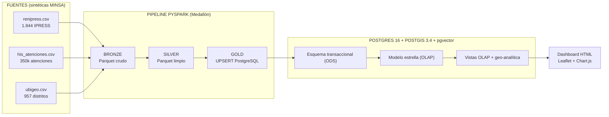

**Lectura del flujo:** las fuentes sintéticas se ingieren a una capa Bronze (Parquet),
se limpian en Silver, y la capa Gold carga PostgreSQL con semántica UPSERT. A partir de
las tablas transaccionales se materializa el modelo dimensional, que alimenta las vistas
OLAP y el dashboard.

---

## 3. Arquitectura Medallón (Bronze / Silver / Gold)

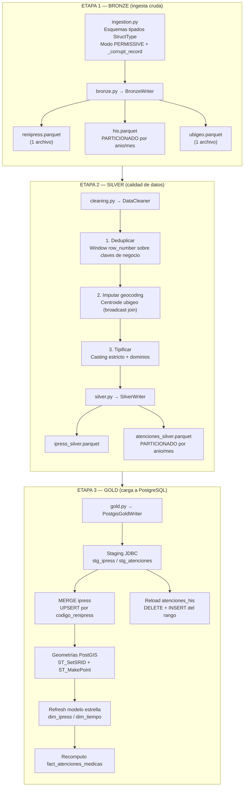

### Detalle por capa

| Capa | Módulo | Responsabilidad | Salida |
|---|---|---|---|
| **Bronze** | `src/ingestion.py`, `src/bronze.py` | Persistir el dato **crudo** sin transformar, con esquema tipado y aislamiento de registros corruptos | Parquet en `data/lakehouse/bronze/` |
| **Silver** | `src/cleaning.py`, `src/silver.py` | Deduplicación, imputación de coordenadas y tipificación estricta (dominios, booleano, nulos) | Parquet en `data/lakehouse/silver/` |
| **Gold** | `src/gold.py`, `src/config.py` | Carga **incremental idempotente** a PostgreSQL con MERGE/UPSERT y mantenimiento del modelo dimensional | Tablas PostgreSQL |

### Decisiones técnicas clave

- **Esquemas tipados en lectura** (`StructType`): evita un pase completo de inferencia de
  esquema → ~2x más rápido en volúmenes masivos.
- **Modo `PERMISSIVE`** + columna `_corrupt_record`: los registros malformados se aíslan y
  auditan sin abortar el batch.
- **Particionamiento físico por `anio`/`mes`** en Bronze y Silver → *pruning* eficiente en
  consultas temporales y escrituras incrementales (una partición = un mes).
- **Broadcast join** del ubigeo (tabla pequeña, KB) al imputar geocoding → evita shuffles.
- **`spark.sql.adaptive.enabled` (AQE)** y `autoBroadcastJoinThreshold` de 10 MB para
  coalesce dinámico y joins eficientes.
- **Driver JDBC en `spark.driver.extraClassPath`**: en modo `local[*]` evita el `fetchFile`
  de Hadoop/winutils en Windows.

### Calidad de datos (Silver)

| Regla | Implementación |
|---|---|
| Dedup de IPRESS | `codigo_renipress` (conserva el `id` más reciente) |
| Dedup de atenciones | Clave compuesta del evento (ipress + ubigeo + fecha + especialidad + CIE-10 + tipo + edad + sexo) |
| Geocoding imputado | Latitud/longitud faltantes = centroide del distrito INEI |
| Normalización | `UPPER` + `TRIM` en claves, nombres y geografía |
| Booleano | `tiene_ambulancia` → `true/false` a partir de `t/f/1/0` |
| Dominios HIS | Solo fechas válidas y `tipo_atencion ∈ {CONSULTA, EMERGENCIA, HOSPITALIZACION, PREVENTIVA}` |
| Invariantes | `fecha_key = "yyyy-MM"` coherente con la partición `anio/mes` |

---

## 4. Orquestación del pipeline

El orquestador es `data-pipeline/main.py`, que ejecuta las etapas de un solo comando:
`python main.py --stage all` (o `bronze` / `silver` / `gold` por separado).

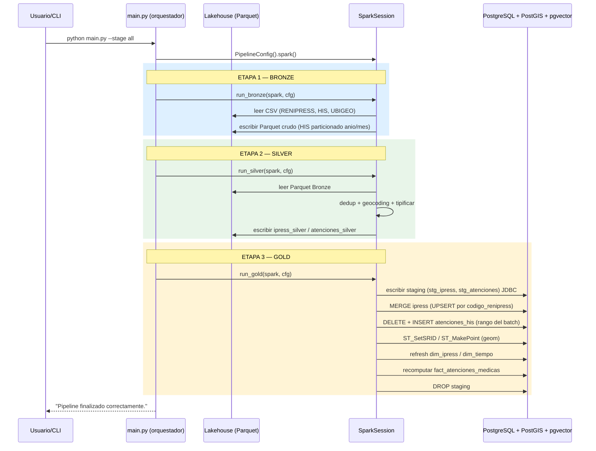

### Idempotencia de la capa Gold

- **Dimensión `ipress`:** `MERGE ... ON t.codigo_renipress = s.codigo_renipress`
  (`WHEN MATCHED → UPDATE`, `WHEN NOT MATCHED → INSERT`).
- **Hechos `atenciones_his`:** *reload idempotente* del rango del batch
  (`DELETE` + `INSERT` del mismo rango temporal = reemplazo de la "partición lógica").
- **Particiones mensuales:** se crean dinámicamente con la función plpgsql
  `crear_particion_mensual(fecha)` antes de cargar.
- **Modelo estrella:** `ON CONFLICT DO UPDATE` / `DO NOTHING` en dims y fact.

---

## 5. Modelo de datos transaccional (ODS)

Esquema operacional normalizado (capas de ingesta) definido en `db/init/02_schema_transaccional.sql`.

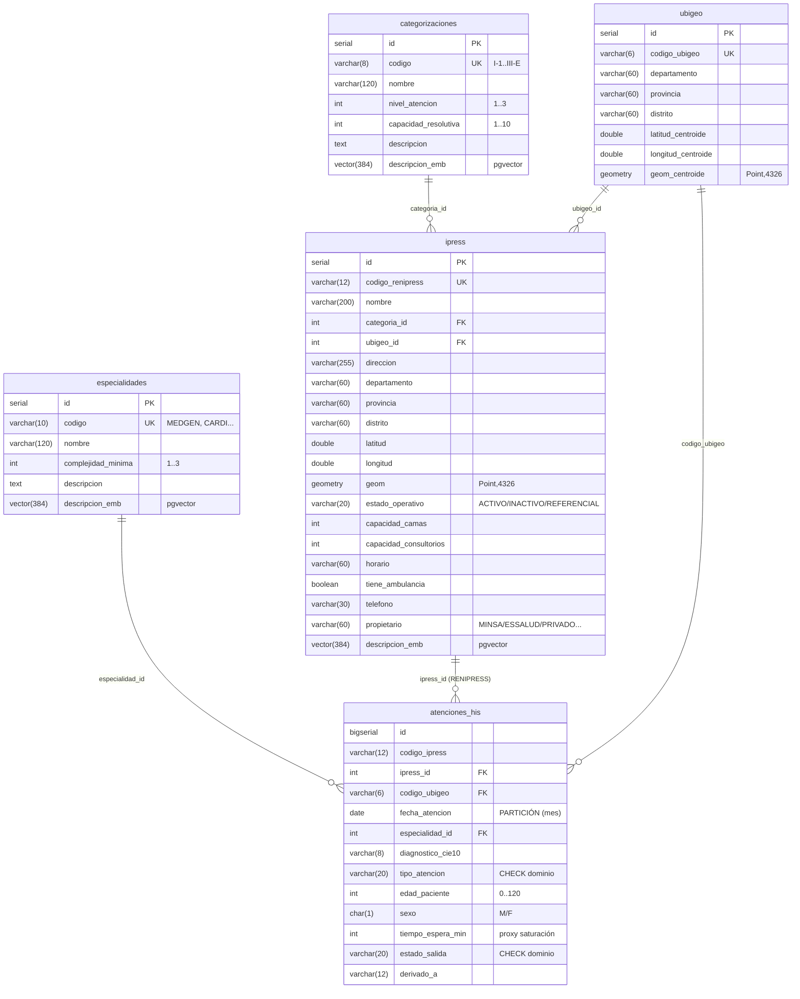

### Detalles del modelo transaccional

| Tabla | Comentario |
|---|---|
| `categorizaciones` | Catálogo MINSA de categorías I-1..III-E con nivel de atención y capacidad resolutiva |
| `especialidades` | Especialidades médicas con la complejidad mínima requerida |
| `ubigeo` | División política INEI + centroide espacial (dimensión pequeña, ideal para broadcast) |
| `ipress` | Establecimientos de salud RENIPRESS con geometría WGS84 y embedding semántico |
| `atenciones_his` | **Tabla particionada por RANGO mensual** (`PARTITION BY RANGE (fecha_atencion)`); PK compuesta `(id, fecha_atencion)` |

### Particionamiento de `atenciones_his`

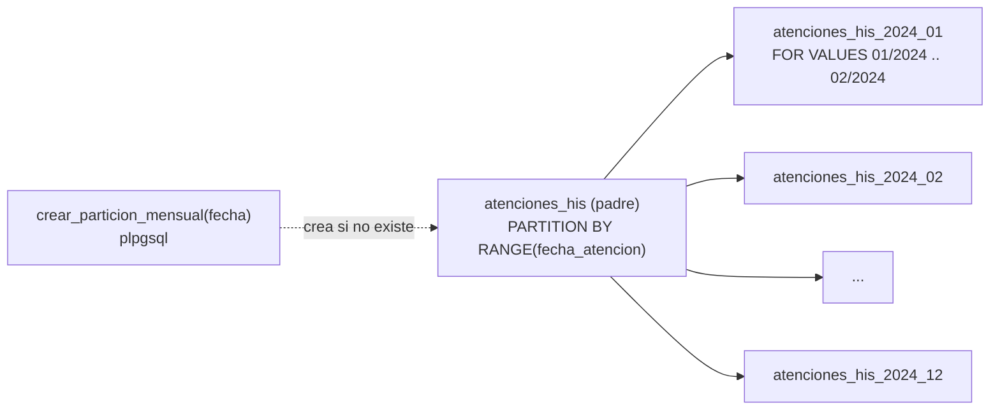

- **Pruning de particiones**: las consultas temporales solo escanean el mes requerido.
- Las 12 particiones de 2024 se crean en `06_seed.sql` (demo) o **dinámicamente** en el
  pipeline Gold (`crear_particion_mensual`) para volúmenes reales.

---

## 6. Modelo dimensional en estrella (Gold / BI)

Modelo Kimball definido en `db/init/03_schema_gold.sql`, orientado a consultas de
inteligencia de negocio sin escanear la tabla particionada de millones de filas.

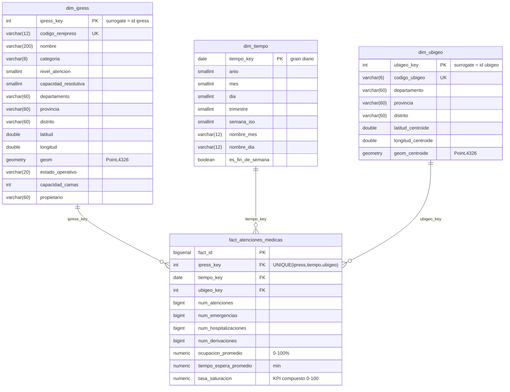

### Métricas de negocio (KPI `tasa_saturacion`)

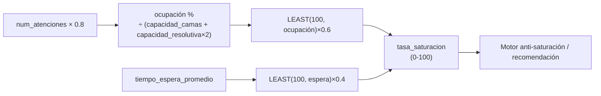

- **Grain del hecho:** IPRESS × día × ubigeo.
- `fact_atenciones_medicas` se refresca por **recomputo del rango del batch** en cada
  corrida del pipeline Gold (`ON CONFLICT DO UPDATE`).

---

## 7. Optimización e índices

Definidos en `db/init/04_indices.sql`. Estrategia por tipo de consulta:

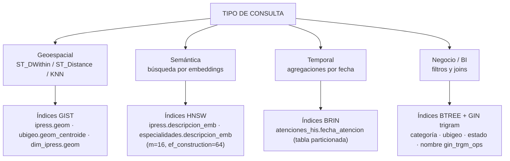

| Índice | Tipo | Columnas | Objetivo |
|---|---|---|---|
| `idx_ipress_geom` | **GIST** | `ipress.geom` | Búsquedas espaciales (`ST_DWithin`, KNN) |
| `idx_ubigeo_geom` | GIST | `ubigeo.geom_centroide` | Geo-referencia de distritos |
| `idx_dim_ipress_geom` | GIST | `dim_ipress.geom` | Geo-analítica OLAP |
| `idx_ipress_emb` | **HNSW** (`vector_cosine_ops`) | `ipress.descripcion_emb` | ANN semántica sub-10ms |
| `idx_especialidades_emb` | HNSW | `especialidades.descripcion_emb` | Búsqueda de especialidades |
| `idx_atenciones_his_fecha` | **BRIN** | `atenciones_his.fecha_atencion` | Pruning en tabla particionada (kB en vez de MB) |
| `idx_ipress_nombre_trgm` | GIN (`gin_trgm_ops`) | `ipress.nombre` | Búsqueda difusa de nombres |
| `idx_fact_tiempo/ubigeo/ipress` | BTREE | FK del fact | Joins OLAP rápidos |

> Alternativa **IVFFlat** (más ligera, requiere entrenamiento con datos) queda documentada
> comentada en `04_indices.sql` para conjuntos grandes cuando HNSW consuma demasiada memoria.

---

## 8. Vistas OLAP y geo-analítica

Definidas en `db/init/05_vistas_olap.sql`. Alimentan el dashboard y los endpoints REST.

| Vista | Contenido | Uso |
|---|---|---|
| `vw_cobertura_regional` | Métricas por departamento: IPRESS totales/activas por nivel, saturación promedio, **índice de cobertura cada 10.000 hab**, centroide agregado | Mapa de calor (GeoJSON), KPI regionales |
| `vw_saturacion_ipress` | Saturación promedio (ventana de 90 días) y atenciones del período por IPRESS | Recomendación anti-saturación |
| `vw_brechas_cobertura` | Distritos con distancia a la IPRESS activa más cercana y clasificación: `DESIERTO_SANITARIO` / `DEFICIT_MODERADO` / `COBERTURA_ACEPTABLE` | Detección de desiertos sanitarios |
| `vw_atenciones_mensual` | Tendencia mensual de atenciones/emergencias/saturación por departamento | Series de tiempo (Prophet) |

### Ejemplo: clasificación de brechas

```mermaid
flowchart LR
    D["Distrito (ubigeo)"] --> C{IPRESS activas<br/>a ≤ 10 km (ST_DWithin)}
    C -->|"0"| A["DESIERTO_SANITARIO"]
    C -->|"1-2"| B["DEFICIT_MODERADO"]
    C -->|"≥ 3"| OK["COBERTURA_ACEPTABLE"]
```

---

## 9. Despliegue e infraestructura

La base de datos se despliega con Docker Compose (`docker-compose.yml`) sobre una imagen
`postgis/postgis:16-3.4` + paquete `postgresql-16-pgvector` (`Dockerfile.db`).

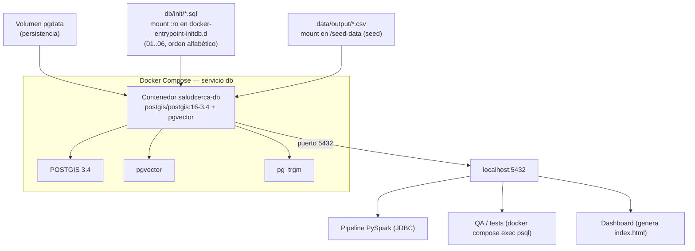

### Scripts de inicialización (`db/init/`, ejecutados una sola vez en el primer arranque)

| Orden | Script | Contenido |
|---|---|---|
| 01 | `01_extensions.sql` | Habilita `postgis`, `postgis_topology`, `vector`, `pg_trgm` |
| 02 | `02_schema_transaccional.sql` | Esquema ODS + tabla particionada + `crear_particion_mensual` |
| 03 | `03_schema_gold.sql` | Modelo dimensional en estrella |
| 04 | `04_indices.sql` | Índices GIST / HNSW / BRIN / BTREE / trigram |
| 05 | `05_vistas_olap.sql` | Vistas OLAP y geo-analíticas |
| 06 | `06_seed.sql` | COPY de CSVs sintéticos + geometrías + materialización del modelo estrella |

---

## 10. Control de calidad y pruebas

### Suite SQL de la capa Gold (`qa/check_gold.sql`)

Ejecutada por `qa/run_qa.py` con `ON_ERROR_STOP=1`; cada bloque `DO ... ASSERT` aborta si
una validación falla. **10 validaciones**:

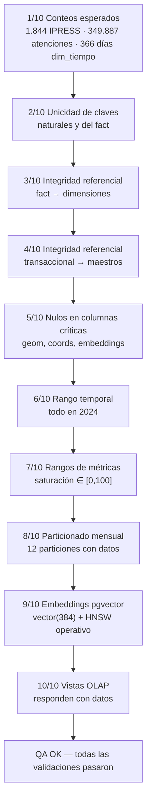

### Test de idempotencia end-to-end (`qa/test_idempotencia.py`)

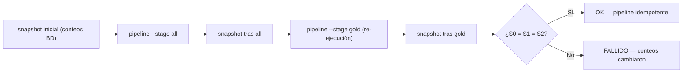

### Tests pytest (`data-pipeline/tests/`)

| Archivo | Cobertura |
|---|---|
| `test_ingestion.py` | Conteos y esquemas de lectura; sin registros corruptos; fechas en rango |
| `test_cleaning.py` | Dedup (fila más reciente), geocoding imputado, tipificación IPRESS/HIS |
| `test_bronze_silver.py` | Integración Bronze→Silver: conteos (1.844 / 349.887) e invariantes de calidad |
| `ml/tests/test_ml.py` | DBSCAN (sintético + Silver: 1.649 activas), features y forecast (estructura, tendencia, determinismo) |

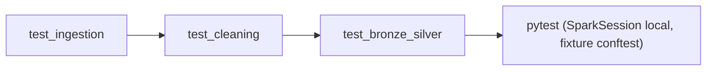

---

## 11. Dashboard geo-analítico

`dashboard/generar_dashboard.py` genera un **HTML autónomo** (Leaflet + Chart.js desde
CDN) consultando la capa Gold mediante `docker compose exec db psql`. Sin dependencias
externas (solo stdlib).

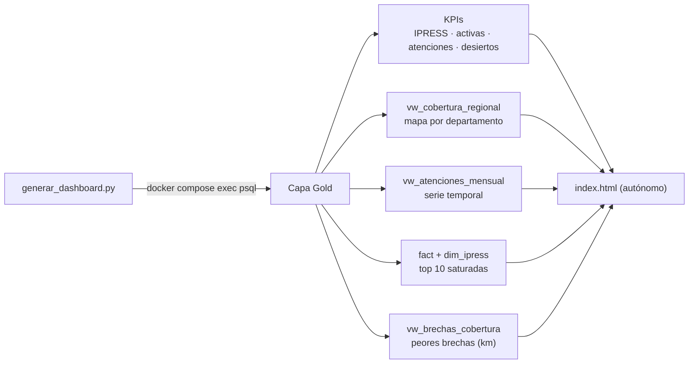

**Visualizaciones incluidas:**
- KPIs superiores (establecimientos, activas, atenciones 2024, desiertos sanitarios).
- Mapa de cobertura por departamento (radio ∝ nº IPRESS, color = saturación promedio).
- Tendencia mensual de atenciones vs emergencias (Chart.js línea).
- Top 10 IPRESS saturadas y peores brechas de cobertura (tablas).
- Gráfico de barras IPRESS por departamento.

---

## 12. Guía de uso

### Requisitos

- Python 3.10+ · PySpark 3.5.5 (`data-pipeline/requirements.txt`)
- Docker + Docker Compose
- JDK 17 (Eclipse Adoptium) y Hadoop winutils para ejecutar Spark local en Windows
  (ver `JAVA_HOME` / `HADOOP_HOME` en `qa/test_idempotencia.py`)

### Flujo completo

```bash
# 1. Generar dataset sintético (data/output/*.csv)
python data/generate_seed.py --rows 350000

# 2. Levantar PostgreSQL + PostGIS + pgvector (esquema + seed automático)
docker compose up -d --build db
docker compose logs -f db
#   Nota: en volúmenes existentes (con datos viejos) reiniciar limpio:
#   docker compose down -v && docker compose up -d --build db

# 3. Ejecutar el pipeline Medallón
python data-pipeline/main.py                # todas las etapas
python data-pipeline/main.py --stage bronze # solo ingesta
python data-pipeline/main.py --stage silver # solo limpieza
python data-pipeline/main.py --stage gold   # solo UPSERT a PostgreSQL

# 4. Control de calidad
python qa/run_qa.py                          # 10 validaciones de la capa Gold
python qa/run_qa_derivaciones.py             # motor de derivación inteligente
python qa/test_idempotencia.py               # idempotencia end-to-end

# 5. Tests unitarios / integración
pytest data-pipeline/tests

# 6. Generar y abrir el dashboard
python dashboard/generar_dashboard.py
start dashboard/index.html

# 7. Módulo ML (DBSCAN + forecast sobre la capa Silver)
pip install -r ml/requirements-ml.txt
python ml/main.py
python ml/main.py --eps-km 20 --min-samples 3 --horizon 12   # ajustes por CLI
pytest ml/tests
```

### Verificación de carga (seed)

El script `06_seed.sql` finaliza con un resumen de filas por tabla:

| Tabla | Filas esperadas |
|---|---|
| `categorizaciones` | 9 |
| `especialidades` | 16 |
| `ubigeo` | 957 |
| `ipress` | 1.844 |
| `atenciones_his` | 350.000 al seed (crudas) → **349.887** tras el reload de la etapa Gold |
| `fact_atenciones_medicas` | agregados (IPRESS × día × ubigeo) |
| `dim_tiempo` | 366 (2024 bisiesto) |

---

## 13. Roadmap y pendientes

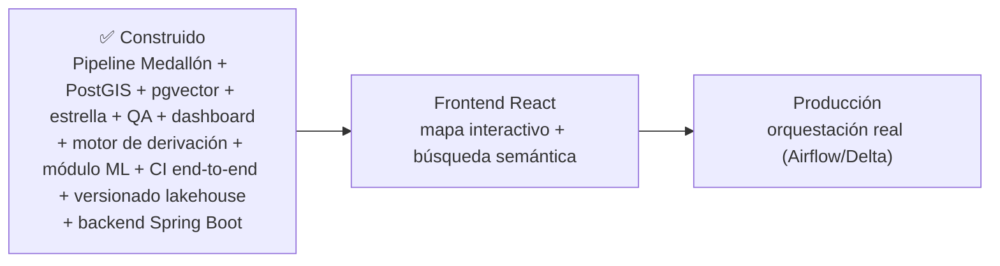

| Pendiente | Detalle |
|---|---|
| **Frontend React** | Consumo de la API; búsqueda semántica pgvector y geo-referencia |
| **Producción / Gobernanza** | Orquestación real (Airflow/Delta) |

**Construido:** motor de derivación (sección 14), módulo ML (sección 15:
DBSCAN de IPRESS + forecast mensual sobre la capa Silver), gobernanza (sección
16: CI end-to-end en GitHub Actions + MANIFEST de versionado del lakehouse) y
backend Spring Boot (sección 17: API REST sobre la capa Gold). El **primer
commit** está publicado en GitHub (`master`).

---

## 14. Motor de derivación inteligente

Convierte la derivación de pacientes de "elección por papel" a una **recomendación
basada en datos**. Surge de un hallazgo del análisis del dataset: **~40% de las
atenciones `DERIVADO` no tenían destino asignado** y ~6% apuntaban a IPRESS no
activas. El motor garantiza que toda referencia tenga un destino **ACTIVO, de nivel
adecuado, no saturado y cercano**.

### Componentes (`db/init/07_derivacion.sql`)

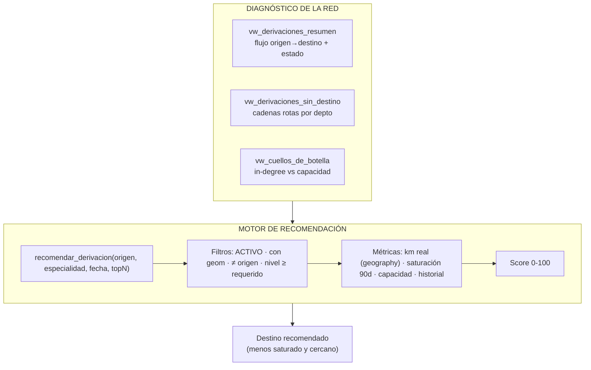

### Score compuesto

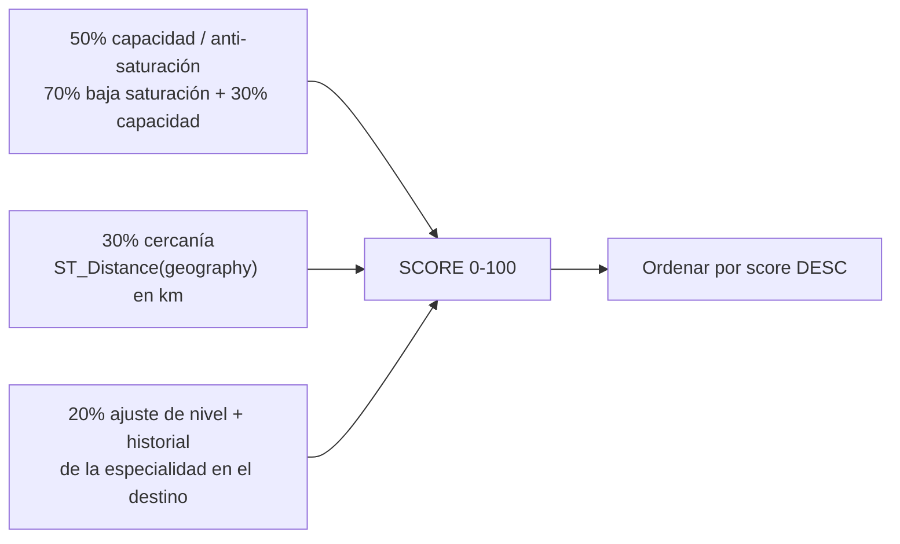

### Garantías verificadas por QA (`qa/check_derivaciones.sql`, `qa/run_qa_derivaciones.py`)

- 0 derivaciones sin destino · 0 a códigos inexistentes · 0 a IPRESS no activas.
- 0 derivaciones a nivel menor que el origen.
- El motor retorna candidatos ACTIVOS, ordenados por score, sin incluir el origen
  y respetando el nivel de la especialidad (`recomendar_derivacion`).

---

## 15. Módulo ML

Dos modelos de apoyo a la planificación de red, construidos puro-Python sobre la
capa **Silver** del lakehouse (`ml/`), sin depender de la BD. Artefactos en
`data/lakehouse/ml/`.

### 15.1 Clustering DBSCAN de IPRESS activas (`ml/clustering_dbscan.py`)

Identifica **polos de oferta de salud** (clusters) y **IPRESS aisladas** (ruido →
candidatas a desiertos sanitarios) usando distancia **haversine** (km reales):

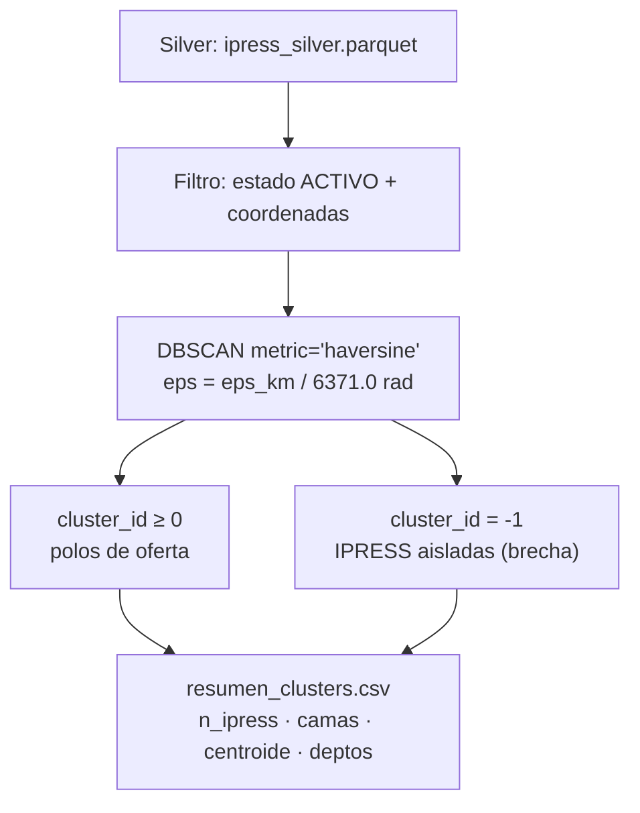

- Parámetros por defecto: `eps=25 km`, `min_samples=4` (ajustables por CLI).
- **Propiedad verificada en tests:** todo punto no-ruido tiene un vecino a < eps.

### 15.2 Forecast mensual estilo Prophet (`ml/forecast.py`)

Modelo aditivo **tendencia lineal + estacionalidad mensual** por mínimos cuadrados:

```
y = a + b·t + Σₘ dₘ·I(mes=m) + ε
```

Con la API de Prophet (`ds` / `yhat` / `yhat_lower` / `yhat_upper`) para que sea
intercambiable por un Prophet real en producción. Ajuste con `numpy.lstsq`
(determinista, sin dependencias pesadas) y **piso de 2% del nivel medio** en la
banda de confianza (evita bandas de ancho cero con series cortas).

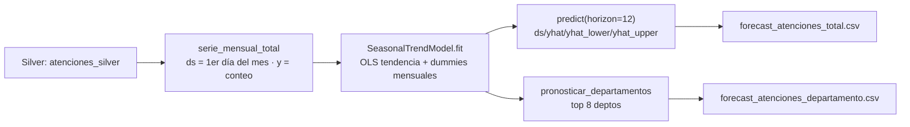

### Resultados del batch 2024 (Silver)

| Modelo | Resultado |
|---|---|
| **DBSCAN** (eps=25 km) | **51 clusters** · 1.559 IPRESS agrupadas (94,5%) · **90 aisladas** (5,5%) · cluster mayor: CALLAO+LIMA (601) |
| **Forecast** 2025 | Nivel **~29.300–29.900 atenciones/mes**; pendiente ≈ −89/mes; pico estacional: octubre |

> ⚠️ Con solo 12 meses de historia el modelo queda **saturado** (RMSE in-sample 0):
> el perfil estacional equivale al año observado y la banda usa el piso del 2%.
> Con 2+ años de historia (o datos reales MINSA) la banda pasa a derivarse de los
> residuos y el MAPE se vuelve informativo.

---

## 16. Gobernanza y CI

### 16.1 Integración continua (` .github/workflows/ci.yml`)

Un solo job end-to-end que reproduce la validación completa sobre un runner
limpio de Ubuntu:

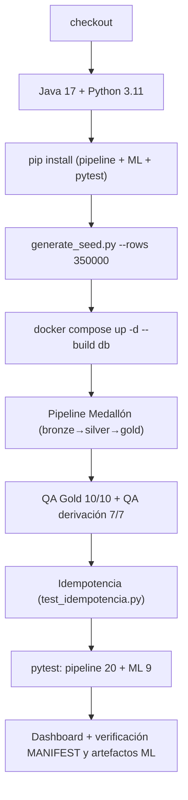

- **Portabilidad de los tests:** los de `data-pipeline` requieren ejecutarse desde
  `data-pipeline/` (rutas relativas); los de `ml/` calculan su propio root. El
  workflow respeta ambas convenciones.
- **La base se levanta con `docker compose`** (PostGIS + pgvector), igual que en
  local, por lo que los tests de derivación que consultan la BD (`docker compose
  exec db psql`) también corren en CI.
- El driver JDBC de PostgreSQL se descarga en CI si no está en el repo.

### 16.2 Versionado del lakehouse (`data-pipeline/src/manifest.py`)

Cada etapa escribe/actualiza `data/lakehouse/MANIFEST.json` con **traza de
procedencia**: conteos reportados vs conteos reales leídos del Parquet, versión
del esquema (`1.0.0`), fecha de generación (UTC) y commit de git. Sirve para
auditar qué hay en cada capa y reproducir el pipeline.

```mermaid
flowchart LR
    P["main.py --stage bronze|silver|gold"] --> M["escribir_manifest()"]
    M --> V["_conteos_parquet()<br/>verificación cruzada"]
    M --> F["MANIFEST.json<br/>esquema · conteos · fecha · commit"]
```

> Ejemplo real (batch 2024): bronze 1.844 IPRESS / 350.000 atenciones / 957
> ubigeo → silver 349.887 (113 duplicados eliminados) → gold 349.887 en `atenciones_his`.

---

## 17. Backend Spring Boot

API REST sobre la capa Gold (`backend/`, Java 17 + Spring Boot 3.5.x) que
convierte el lakehouse en un servicio consumible por el frontend React.

```mermaid
flowchart LR
    API["API REST :8080"] --> H["Health"]
    API --> I["/api/ipress<br/>detalle + cercanas (PostGIS)"]
    API --> E["/api/especialidades"]
    API --> B["/api/buscar<br/>semántico pgvector"]
    API --> D["/api/derivacion<br/>motor anti-saturación"]
    B --> SEM["SemanticEncoder.java<br/>= embedding_encoder.py (SHA-1 + módulo)"]
    SEM --> PG["pgvector HNSW<br/>cosine <=>"]
    I --> PG2["PostGIS ST_DWithin"]
    D --> F["recomendar_derivacion()"]
```

### 17.1 Endpoints

| Método / Ruta | Descripción |
|---|---|
| `GET /api/health` | Estado de la API y de la conexión a la capa Gold |
| `GET /api/ipress/{codigo}` | Detalle de una IPRESS (categoría, nivel, geom, capacidad) |
| `GET /api/ipress/cercanas?lat&lon&radioKm&limite` | IPRESS ACTIVAS en un radio, ordenadas por distancia real (geography) |
| `GET /api/especialidades` | Catálogo de especialidades médicas |
| `GET /api/buscar/ipress?texto&topK` | Búsqueda semántica pgvector sobre `ipress.descripcion_emb` |
| `GET /api/buscar/especialidad?texto&topK` | Búsqueda semántica sobre `especialidades.descripcion_emb` |
| `GET /api/derivacion/recomendar?origen&especialidad&fecha&topN` | Invoca `recomendar_derivacion()` (score 0-100) |

### 17.2 Reproducibilidad del embedding

`SemanticEncoder.java` implementa **exactamente** el algoritmo de
`data/embedding_encoder.py` (normalización NFKD → n-gramas n=1..4 → `SHA-1`
de 4 bytes como uint32 → `v[h % 384] += ±1` → L2). El test
`SemanticEncoderTest` verifica los **mismos valores de referencia que Python**
(componentes del vector, similitudes coseno y normalización): 4/4 tests verdes.
Esto garantiza que las consultas del backend usan el mismo espacio vectorial
que los embeddings persistidos por el pipeline.

### 17.3 Build y ejecución

```bash
cd backend
sh mvnw package            # Maven Wrapper 3.9.16 (no requiere Maven instalado)
java -jar target/backend-1.0.0.jar
```

El CI compila el backend en un job independiente (`sh mvnw -B -ntp package`).

---

## Apéndice: estructura del repositorio

```text
SaludCerca/
├── docker-compose.yml          # Servicio db: PostGIS + pgvector
├── Dockerfile.db               # Imagen base postgis + paquete pgvector
├── .gitignore
├── .github/workflows/
│   └── ci.yml                  # CI end-to-end (pipeline + QA + tests + backend)
├── backend/                    # API REST Spring Boot (Gold / PostGIS / pgvector)
│   ├── pom.xml                 # Spring Boot 3.5.16, Java 17
│   ├── mvnw / mvnw.cmd         # Maven Wrapper 3.9.16 (build reproducible)
│   └── src/main/java/pe/saludcerca/backend/
│       ├── SaludCercaBackendApplication.java
│       ├── config/CorsConfig.java
│       ├── semantic/SemanticEncoder.java   # Espejo Java de embedding_encoder.py
│       ├── service/            # IpressService, DerivacionService, BusquedaService
│       └── web/                # Controllers REST + DTOs (records)
├── data/
│   ├── generate_seed.py        # Generador de dataset sintético (seed=42)
│   ├── embedding_encoder.py    # Embeddings determinísticos 384d (pgvector)
│   └── output/                 # CSVs generados (renipress, his, ubigeo, ...)
├── data-pipeline/
│   ├── main.py                 # Orquestador (bronze/silver/gold/all)
│   ├── requirements.txt        # pyspark==3.5.5, pandas, pyarrow
│   ├── src/
│   │   ├── config.py           # SparkSession + rutas + JDBC
│   │   ├── ingestion.py        # Lectores CSV/JSON (esquemas tipados)
│   │   ├── bronze.py           # Capa Bronze (Parquet crudo)
│   │   ├── cleaning.py         # Calidad de datos (dedup/geocoding/tipificar)
│   │   ├── silver.py           # Capa Silver (Parquet limpio)
│   │   ├── gold.py             # Capa Gold (UPSERT PostgreSQL + estrella)
│   │   └── manifest.py         # Versionado del lakehouse (MANIFEST.json)
│   └── tests/                  # pytest (ingestion, cleaning, bronze→silver, derivación)
├── db/init/
│   ├── 01_extensions.sql       # postgis, vector, pg_trgm
│   ├── 02_schema_transaccional.sql  # ODS + partición mensual
│   ├── 03_schema_gold.sql      # Modelo dimensional estrella
│   ├── 04_indices.sql          # GIST / HNSW / BRIN / BTREE
│   ├── 05_vistas_olap.sql      # Vistas geo-analíticas
│   ├── 06_seed.sql             # Carga sintética + materialización estrella
│   └── 07_derivacion.sql       # Motor de derivación inteligente (vistas + función)
├── dashboard/
│   └── generar_dashboard.py    # Genera index.html (Leaflet + Chart.js)
├── qa/
│   ├── check_gold.sql          # 10 validaciones de la capa Gold
│   ├── run_qa.py               # Ejecuta la suite SQL
│   ├── check_derivaciones.sql  # QA del motor de derivación
│   ├── run_qa_derivaciones.py  # Ejecuta el QA del motor
│   └── test_idempotencia.py    # Idempotencia end-to-end del pipeline
├── ml/                         # Módulo ML (sobre capa Silver, sin BD)
│   ├── main.py                 # Orquestador (DBSCAN + forecast)
│   ├── features.py             # Carga Silver + series mensuales
│   ├── clustering_dbscan.py    # GeoClusterer (DBSCAN haversine)
│   ├── forecast.py             # SeasonalTrendModel (estilo Prophet)
│   ├── requirements-ml.txt     # numpy, pandas, pyarrow, scikit-learn, matplotlib
│   └── tests/test_ml.py        # pytest del módulo ML (9 tests)
└── docs/
    └── SISTEMA.md              # Este documento
```
