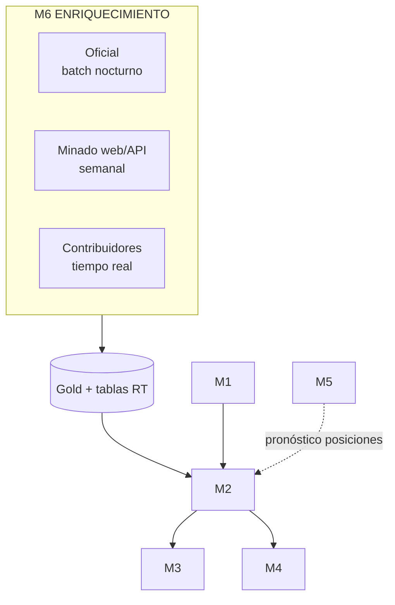

# Módulos M1–M6

> Detalle completo con diagramas en `docs/PRODUCTO.md` · Visión: [[Vision-Producto]]

| Módulo | Nombre | Esencia | Fase |
|---|---|---|---|
| **M1** | Canal de emergencia ciudadano | Botón SOS PWA/RN + chatbot WhatsApp + IVR; triaje rápido C1–C4 | F1/F5 |
| **M2** | Despacho inteligente ⭐ | Unidad más cercana disponible (PostGIS) + hospital destino = `recomendar_derivacion()` v2 con capacidad RT | F0–F2 |
| **M3** | App ambulancia | Estados ("en camino/paciente a bordo/entregado"), GPS continuo, registro offline-first | F1 |
| **M4** | Panel SaaS operador | Mapa flota WebSocket, cola emergencias, KPIs tiempo-respuesta; dashboard analítico actual como pestaña premium | F1 |
| **M5** | Posicionamiento predictivo ML | Forecast zonal×hora → dynamic standby de unidades (estilo Uber), reduce respuesta 20–40% | F4 |
| **M6** | Enriquecimiento + red contribuidores | 3 canales: oficial (RENIPRESS/SUSALUD/INEI) · minado (OSM Overpass, Places top500) · humano pagado con reputación y pagos Yape/Plin | F2–F3 |

Ver [[Suscripciones-Economia]] para cómo se paga todo esto.
