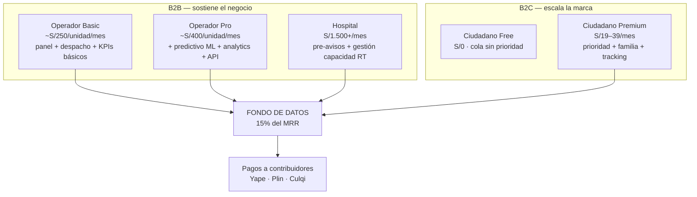

# Suscripciones y Economía

## Planes (precios orientativos mercado peruano)

## Ejemplo de unit economics
- Cliente tipo: empresa con **10 ambulancias** en Operador Basic → ~S/2.500/mes.
- Con 20 clientes similares → **~S/60k MRR**.
- Fondo de datos 15% → ~S/9k/mes repartidos en tareas: un reporte puntual S/2–5, auditoría completa S/10–20.

## Reglas económicas de la red de contribuidores
1. El pago se libera solo tras **validación** (doble en datos críticos: camas UCI, cierres).
2. La recompensa escala con reputación (ver [[../04-Decisiones/ADR-003-Conocimiento-Obsidian-Graphify]] no aplica aquí — reputación definida en `09_enriquecimiento.sql`).
3. Reporte falso confirmado = penalización reputacional fuerte (peso del voto → 0).
4. Presupuesto semanal por zona para evitar inflación de reportes triviales.

## Costos operativos estimados (MVP)
| Concepto | Costo mensual aprox |
|---|---|
| VPS (API + Postgres + OSRM) | $40–80 |
| Google Places API (solo top 500) | $0–200 |
| WhatsApp Business API | variable por conversación |
| Pasarela (Culqi ~3.5% por transacción) | % ingresos |
