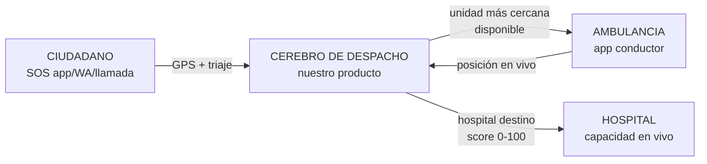

# Visión de Producto

> Detalle completo en `docs/PRODUCTO.md` · Módulos: [[Modulos-M1-M6]]

## Problema
En el Perú, una emergencia médica se resuelve mal por tres razones simultáneas:
1. **Despacho a ciegas**: no existe visibilidad de qué ambulancia está disponible ni dónde.
2. **Destino equivocado**: hospitales saturados reciben pacientes que otra unidad cercana podía atender (el propio dataset demostró ~40% de derivaciones sin destino).
3. **Datos muertos**: la información oficial (RENIPRESS, SUSALUD) se actualiza mensualmente y no refleja capacidad real del día.

## Propuesta de valor
**"Uber de ambulancias + cerebro anti-saturación"** como SaaS para operadores privados/municipales, con cara ciudadana después ([[ADR-001-Estrategia-B2B-Primero]]).

## Los 3 actores y qué gana cada uno
| Actor | Duele hoy | Gana con nosotros |
|---|---|---|
| **Operador B2B** (cliente que paga) | despacho telefónico, sin KPIs, unidades ociosas | panel tiempo real, KPIs de respuesta, posicionamiento predictivo |
| **Ciudadano** | no sabe dónde acudir, esperas eternas | SOS con GPS, destino correcto a la primera |
| **Contribuidor** (nos da información) | su conocimiento no vale nada | paga por reporte verificado vía Yape/Plin |

## Por qué ganamos (moat)
- **Datos**: nadie más combina RENIPRESS 35k + recursos SUSALUD (incluye ambulancias por IPRESS) + minado OSM + red humana verificada.
- **Algoritmo**: motor anti-saturación ya construido y probado con QA.
- **Economía de red**: más contribuidores → mejores datos → mejor servicio → más suscriptores → más presupuesto para contribuidores.
