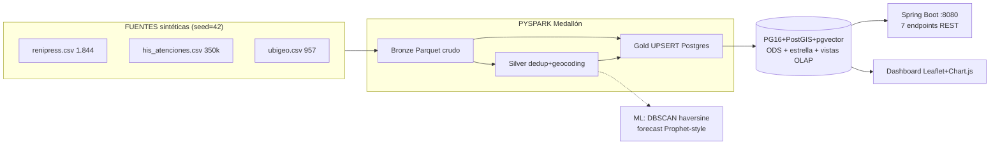

# Arquitectura Actual (base construida)

> Fuente canónica técnica: `docs/SISTEMA.md` · Evolución nueva: [[Evolucion-Tiempo-Real]]

## Piezas clave que el producto REUTILIZA
| Pieza | Ubicación | Uso futuro |
|---|---|---|
| `recomendar_derivacion()` score 50/30/20 | `db/init/07_derivacion.sql` | núcleo del destino hospitalario v2 |
| Búsqueda geo `ST_DWithin` geography | `IpressService` backend | patrón para ambulancias cercanas |
| Embeddings pgvector HNSW deterministas | `data/embedding_encoder.py` + espejo Java | búsqueda semántica ciudadana |
| KPI saturación 0-100 | `fact_atenciones_medicas` | insumo del score anti-saturación |
| QA idempotente + CI e2e | `qa/`, `.github/workflows/ci.yml` | extender a tablas operativas |
