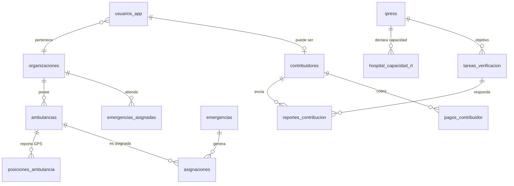

# Evolución Tiempo Real (F0)

> Base actual: [[Arquitectura-Actual]] · Tablas definidas en `db/init/08_despacho.sql` y `09_enriquecimiento.sql`

## Modelo operativo nuevo

## Decisiones de diseño F0
1. **Geometría en cada tabla móvil** (`ambulancias.geom`, `emergencias.geom`, `tareas_verificacion.geom`) con índice GIST → consultas KNN sin joins.
2. **Timestamps SLA explícitos** en `emergencias` (creada→asignada→llegada_escena→traslado→entregada): miden la métrica reina sin inferir.
3. **Procedencia siempre**: `hospital_capacidad_rt.actualizado_por ∈ {OFICIAL, OPERADOR, CONTRIBUIDOR, SISTEMA}` + vigencia → datos vencidos se excluyen del score.
4. **Reputación como campo numérico simple** (50 base, ±delta por validación) — sin tablas de historial en F0.
5. Los scripts `08/09` siguen el patrón de init Docker (solo corren en primer arranque); para volúmenes existentes aplicar manualmente.

## Endpoints nuevos (backend)
| Método/ruta | Descripción |
|---|---|
| `GET /api/despacho/ambulancias?estado&organizacionId` | Flota filtrable |
| `POST /api/despacho/ambulancias/{id}/posicion` | Reporte GPS del conductor |
| `GET /api/despacho/ambulancias/cercanas?lat&lon&radioKm&tipoMin` | Unidades disponibles ordenadas por km |
| `POST /api/despacho/emergencias` | Crear emergencia (canal, GPS, triaje) |
| `GET /api/despacho/emergencias/activas` | Cola operativa |
| `POST /api/despacho/emergencias/{id}/asignar/{ambulanciaId}` | Asignación + timestamps SLA |
| `GET /api/contribucion/tareas?lat&lon&radioKm` | Cola geo de verificación |
| `POST /api/contribucion/reportes` | Recibir reporte de contribuidor |
