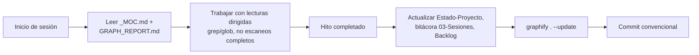

# ADR-003 — Conocimiento: Obsidian vault versionado + Graphify

## Contexto
Desarrollo asistido por IA consume muchos tokens re-explorando el código en cada sesión. El usuario pidió integrar Obsidian y Graphify de forma permanente y optimizar gasto de tokens durante todo el desarrollo.

## Decisión
1. Vault Obsidian en `docs/vault/` **dentro del repo**, versionado en Git (`.obsidian/workspace*` ignorado).
2. **Graphify** (`pip install graphifyy`) genera `graphify-out/`: `GRAPH_REPORT.md` (resumen compacto que la IA lee primero) + `graph.json` + `graph.html`.
3. `AGENTS.md` en raíz carga reglas permanentes en cada sesión de opencode.
4. Sin hooks git automáticos (rebuild usa LLM y ralentizaría commits): actualizar grafo manualmente tras hitos con `graphify . --update`.

## Flujo de trabajo permanente

## Consecuencias
- ✅ Contexto persistente entre sesiones (~70× compresión reportada por Graphify).
- ✅ El graph view de Obsidian da navegación visual del conocimiento.
- ⚠️ Disciplina requerida: notas desactualizadas = peor que ninguna nota. Regla: si tocas código estructural, tocas su nota.
